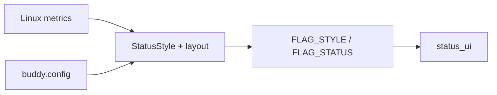

# Architecture

tty-buddy is a **host daemon** plus **ESP32-C3 firmware**. The host owns
metrics, the login PTY, and the USB keyboard. The device owns the LCD, the
front-button OSD, backlight PWM, and sleep. They exchange CRC-framed
messages over USB-Serial/JTAG (CDC). Wire details: [protocol reference](../reference/protocol.md).

## Why this split

The SuperMini presents only a **USB device** port (Serial/JTAG). It cannot
host a keyboard. Putting the keyboard and PTY on Linux keeps the ESP as a
display + input bridge for one button, and lets status metrics use normal
Linux APIs (`/proc`, `systemctl`, netlink-style iface queries).

## Runtime roles

### Host (`daemon/`)

Entry point: `tty-buddy run` (systemd `tty-buddy@<user>`).

| Concern | Module / area |
|---------|----------------|
| Device discovery | `discover` — `/dev/tty-buddy`, then vid/pid/serial from `daemon.toml` |
| Session loop | `bridge` — reconnect forever; status vs terminal; config reload |
| Metrics → StatusSnap | `metrics` + `status_config` |
| PTY + vt100 grid | `terminal` (53×30, same cell geometry as the panel) |
| Keyboard | `keyboard` — **watch** (no grab) in status; **EVIOCGRAB** in terminal |
| Framing / ACK | `serial_io` + `protocol` |
| Settings paths | `settings`, `status_config` |

**Status mode.** Sample about once per second, pack StatusSnap v13, send
with `FLAG_STATUS`. Optionally watch keyboards; activity can switch to
terminal and set `FLAG_ACTIVITY` (wake). Style (`FLAG_STYLE`) is pushed when
config/metrics style inputs change.

**Terminal mode.** Spawn the systemd instance user’s login shell inside a
PTY and push the cell payload at up to `fps` (keystrokes force an immediate
frame). Matching host keyboards are **always EVIOCGRAB’d** while terminal
mode is active (device toggle or keyboard activity), even when
`keyboard_opens_terminal = false`. Cursor flags and activity wake the panel
when needed.

**Config.** `daemon.toml` is host/install (device bind, `shell_user`, path
to panel config). `buddy.config` is panel UX and behaviour; mtime reload
applies without restarting the unit. Brightness/sleep events from the device
rewrite `[display]` when linked.

### Device (`firmware/`)

PlatformIO env `esp32-c3-supermini` (Arduino + TFT_eSPI). Native env builds
protocol unit tests only.

| Concern | Area |
|---------|------|
| Link + modes | `main` — wait for host, status vs terminal paint |
| Status layout | `status_ui` — header / hero / secondary / ifaces / services / alerts |
| VT cells | `terminal` — 53×30 mirror |
| Button, BL, sleep | `osd` — GPIO10 button, GPIO5 PWM, NVS when offline |
| Wire decode | `protocol` — shared with host tests |

**Button.** Short press: open OSD or advance the highlighted row; may
dismiss an alert if configured. Long press: change the selected OSD value,
or toggle mode when the OSD is closed. Idle auto-close for OSD is timed
separately from sleep. With `wake_on_alert`, an active alert wakes the panel
and postpones sleep until the alert clears (timer restarts then); OSD idle
auto-close still runs.

**Factory image.** Post-build `merge_factory.py` merges bootloader,
partitions, boot_app0, and app into `tty-buddy-firmware-<ver>.bin` (version
from `daemon/Cargo.toml`). That file is what releases flash at **0x0**.

## Data flow (summary)

Three paths share the same USB CDC link.

**Status** — host samples metrics, applies `buddy.config`, pushes style/status
frames; device paints `status_ui`.

**Terminal** — PTY grid and keyboard activity become framed cell payloads.

Keys in status mode can open terminal (no grab). In terminal mode they are
grabbed into the PTY.

**Device → host** — button / OSD events; brightness and sleep may rewrite
`buddy.config`.

## Packaging on the host

- Binary: `/usr/bin/tty-buddy`
- Unit: `tty-buddy@.service` — instance name is the Linux user
- udev: Espressif `303a:1001` → `/dev/tty-buddy` (`dialout`)
- Config dir: `/etc/tty-buddy/`

Install scripts bind `shell_user`, groups, and `buddy.config` ownership to
that user. See [daemon package lifecycle](../guides/daemon.md).
